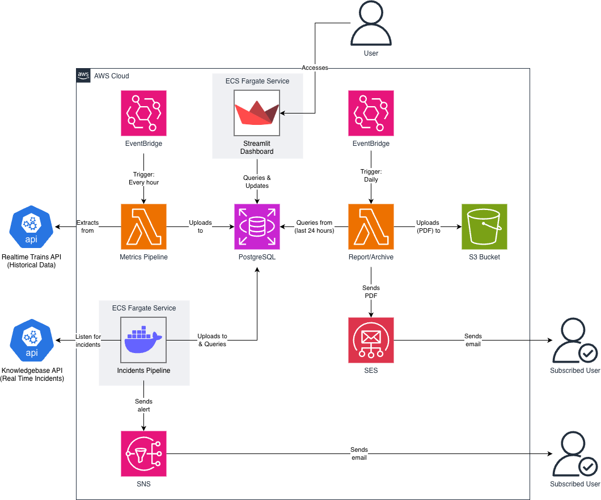
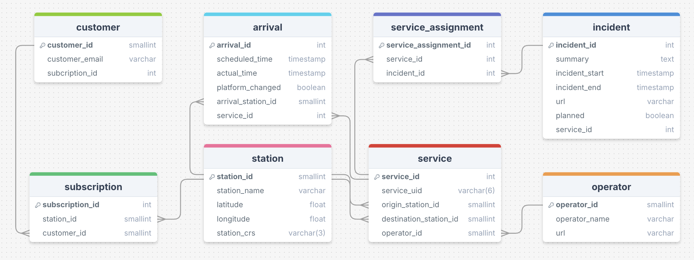

# 🚂 Signal Shift Group Project 🚂

A railway tracking project, involving two data pipelines, a dashboard and automatic report sending system, all fully deployed on AWS.

## 🚂 Introduction 🚂

This project provides a great way of keeping track of current National Rail trains, services, operators and arrivals, as well as providing a handy dashboard with analytics, and the option to subscribe to both a daily report of metrics and any stations in the uk for which you'd like live incidents updates.

## 🚂 Setup 🚂

To begin, ensure you have the [AWS CLI](https://aws.amazon.com/cli/) installed, and run `aws login`, after which you'll be prompted to choose the AWS account to authenticate. This is used for pushing every docker image to the respective AWS repositories.

The project can be initialised by running the bash script: `start.sh`. This script first targets the ECR repositories to create them in isolation. Once these exist on AWS, the bash script will push an image to each of the 4 repositories, and once they exist and can be referred to by the other terraform resources, the script will create all of the other terraform resources.

Each of the separate directories in the project contains their own README, which detail how to set up the environment variables and other necessities for the files in the directory.

## 🚂 Project Structure 🚂

```text
├── report/
    ├── metrics.py
    ├── report_html.py
    ├── report_html.py
│   └── upload_to_s3.py
│
├── dashboard/
│   ├── Dashboard.py
│   ├── database_connection.py
│   ├── incidents_page.py
│   ├── map_visualisation.py
│   ├── metrics.py
│   ├── subscribe_page.py
│   ├── unsubscribe_page.py
│   └── visualisations.py
│
├── metrics_pipeline/
│   ├── extract.py
│   ├── transform.py
│   ├── load.py
│   └── pipeline.py
│
├── incidents_pipeline/
│   ├── alert.py
│   ├── extract.py
│   ├── transform.py
│   ├── load.py
│   └── pipeline.py
│ 
├── database/
│   └── schema.sql
│
└── terraform/
    ├── ecs.tf
    ├── eventbridge.tf
    ├── lambda.tf
    ├── network.tf
    ├── provider.tf
    ├── s3_bucket.tf
    └── variables.tf
```

## 🚂 Architecture Diagram & ERD 🚂





## 🚂 Data Sources 🚂

- The metrics pipeline takes live data from the [RTT API.](https://api.rtt.io/)
- The incidents pipeline takes live data from the [National Rail Data Feeds.](https://opendata.nationalrail.co.uk/feeds)


